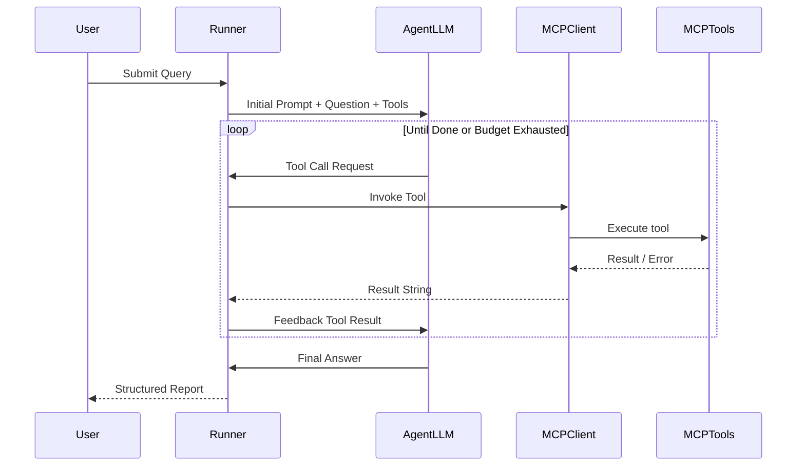
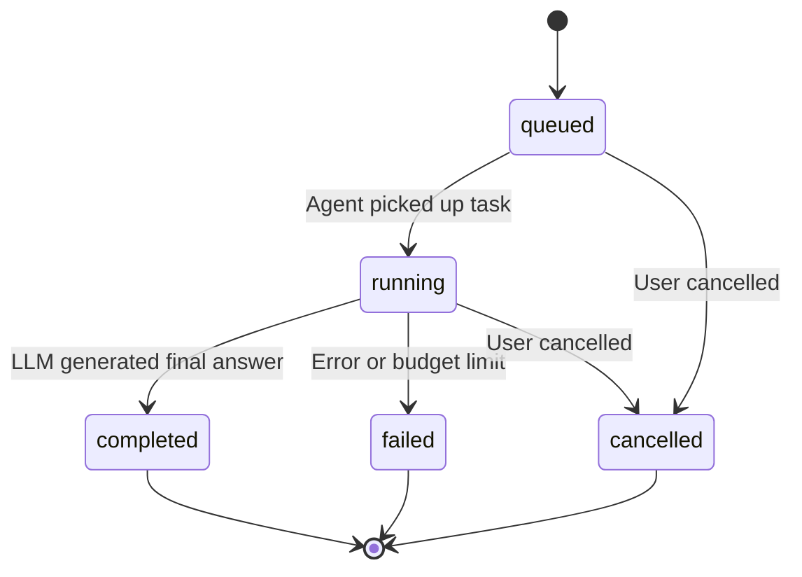
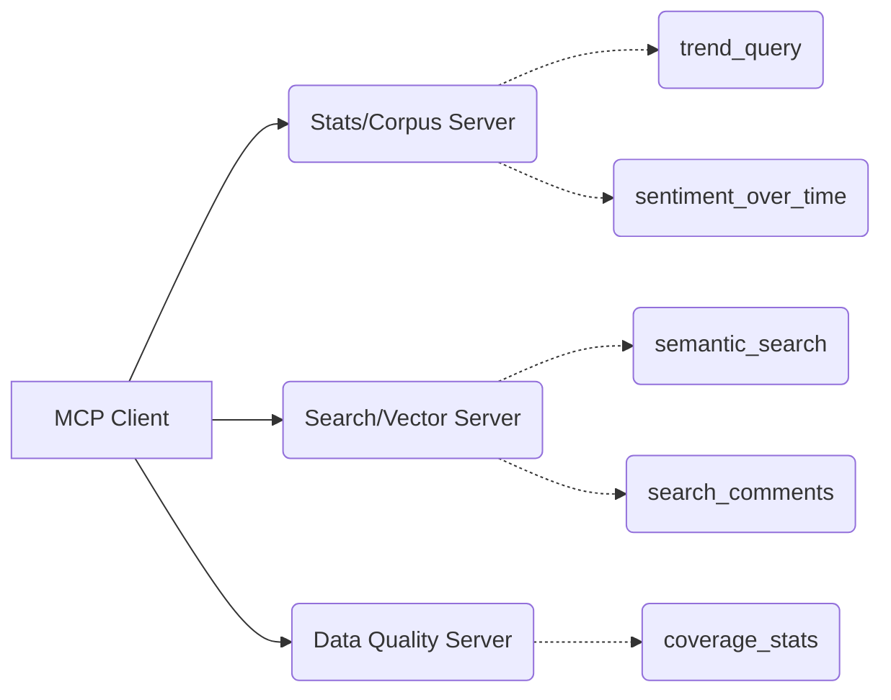

# Agents & Runner Documentation

## 1. Overview
The Defense platform includes a selective, corpus-tier agentic insight layer. 9 specialized AI agents autonomously query the corpus through MCP (Model Context Protocol) servers, producing grounded analytical intelligence. The agent layer sits ABOVE the per-post pipeline — agents are never invoked per-post; they operate at the corpus/campaign level.

- **Agent orchestrator:** [runner.py](src/defense/services/agents/runner.py) (~108KB)
- **Agent definitions:** [registry.py](src/defense/services/agents/registry.py)
- **MCP client:** [mcp_client.py](src/defense/services/agents/mcp_client.py)
- **Run persistence:** [store.py](src/defense/services/agents/store.py)
- **API routes:** [main.py](src/defense/services/agents/main.py)
- **LLM Role:** `agent` (dedicated, default model: `llama3.1:8b-16k`)

## 2. Agent Registry

### 2.1 Analyst (`analyst`)
- **Description:** General-purpose Q&A over the corpus: sentiment trends, activity/engagement levels, top/most-discussed posts, reaction mix
- **Default for:** Questions not specifically about one of the specialties below
- **Tools:** `trend_query`, `sentiment_over_time`, `top_posts`, `reaction_mix`, `semantic_search`, `search_comments`, `get_post`, `get_thread`, `representative_comments`
- **Budget:** 10 tool calls
- **System prompt key rules:** Always call tools for real data, cite post_ids, present as analytical intelligence briefing, show actual numbers/percentages, never output code

### 2.2 Coverage Deep-Dive (`coverage`)
- **Description:** Find low-coverage posts and fetch more comments
- **Tools:** `top_posts`, `get_post`, `fetch_more_comments`
- **Budget:** 5 tool calls
- **System prompt key rules:** Identify posts with <10% comment coverage + high engagement, use fetch_more_comments tool, format as structured audit report

### 2.3 Spike Alerting (`alerting`)
- **Description:** Scheduled monitoring: detect sentiment/toxicity spikes
- **Tools:** `trend_query`, `sentiment_over_time`, `top_posts`
- **Budget:** 8 tool calls
- **System prompt key rules:** Check two thresholds SEPARATELY: negative sentiment >50% and avg toxicity >0.6. The prompt explicitly maps which tool serves which threshold:
  - `trend_query` → returns avg_sentiment AND avg_toxicity per period (the ONLY source for toxicity threshold)
  - `sentiment_over_time` → returns post COUNTS per sentiment, NO toxicity field
  - `top_posts` → the ONLY tool returning post_ids (metric must be total_reactions/comment_count/toxicity_score/hate_speech_score)
- **Required output:** 3 sections: Alert Level & Threat Assessment, Metrics & Spike Data Table, Key Trigger Posts with IDs
- **Design note:** Budget was raised from 5→8 because the model needs to route two thresholds across three tools, and a repeat still spends count

### 2.4 Stance Intelligence (`stance`)
- **Description:** Stance toward NAMED targets (person, organization, policy): who supports or opposes whom
- **Only when:** Question is specifically about support/opposition ("Only when" is load-bearing — without it the router takes general sentiment traffic)
- **Tools:** `stance_by_target`, `stance_over_time`, `semantic_search`, `search_comments`, `get_post`, `get_thread`, `representative_comments`
- **Budget:** 12 tool calls
- **System prompt key rules:** 
  - Call `stance_by_target` with NO target_id first — returned IDs are the only ones that exist
  - Never invent target_ids
  - If stance tool returns nothing → that's about the WATCHLIST, not the date window
  - Format: Target Stance Summary Table (supportive/opposing/neutral/net polarity), Narrative, Post Citations
- **Design note:** Budget raised from 10→12 because comment search encourages more, narrower calls

### 2.5 Comparative (`comparator`)
- **Description:** Compare sentiment, toxicity, engagement across campaigns or time periods
- **Tools:** `trend_query`, `sentiment_over_time`, `top_posts`, `reaction_mix`, `semantic_search`
- **Budget:** 15 tool calls
- **System prompt key rules:** Always retrieve BOTH sides of comparison, present numbers side by side, compute deltas and percentage changes

### 2.6 Toxicity & Harm (`toxicity`)
- **Description:** Deep-dive into toxicity patterns, hate speech, harmful content
- **Tools:** `top_posts`, `get_thread`, `representative_comments`, `search_comments`, `trend_query`, `semantic_search`
- **Budget:** 14 tool calls
- **System prompt key rules:**
  - Use `search_comments` to search for harassment patterns directly ("personal attacks on journalists", "threats")
  - Every quote must be verbatim text a tool returned, cited with post_id and comment_id
  - Harassment category breakdowns must cite actual comment counts
  - Never reconstruct quotes from post-level toxicity scores
- **Design note:** `search_comments` was added specifically because without it the agent could only find toxic POSTS, not search for harassment patterns — the question it exists to answer

### 2.7 Narrative Discovery (`narrative`)
- **Description:** Topic clusters and emerging vs declining themes (only when the question asks about narratives/themes/clusters by name)
- **Tools:** `get_clusters`, `semantic_search`, `search_comments`, `get_post`, `trend_query`, `top_posts`
- **Budget:** 12 tool calls
- **System prompt key rules:**
  - Identify clusters by `label` when present (stored, human-reviewed, stable)
  - When `label` absent, use `representative_summary` verbatim
  - Check `scan_truncated`, `posts_clustered`, `is_stub` on every cluster row
  - If `is_stub=true` → vectors are deterministic hashes, groupings are ARBITRARY — report that clustering is not meaningful

### 2.8 Data Quality & Audit (`quality`)
- **Description:** Audit data quality, coverage, ensemble agreement, provenance
- **Tools:** `coverage_stats`, `agreement_stats`, `top_posts`, `get_post`
- **Budget:** 8 tool calls
- **System prompt key rules:**
  - Report coverage, ensemble agreement, method provenance, and VECTOR provenance
  - Vector provenance is first-class: `stub_embeddings`/`stub_embedding_share` (deterministic hash → arbitrary neighbors), `embedding_models` (>1 = incomparable vector spaces), `comment_vector_coverage` (0 = comment search unreachable), `posts_over_comment_cap`/`comments_dropped_by_cap` (retrieval blind spot, not encoder failure)

### 2.9 Report Drafting (`reporter`)
- **Description:** Draft structured analytical reports from campaign data
- **Tools:** `trend_query`, `sentiment_over_time`, `top_posts`, `reaction_mix`, `semantic_search`, `get_post`, `representative_comments`
- **Budget:** 15 tool calls
- **System prompt key rules:** 6-section format: Executive Summary, Key Findings (numbered with citations), Sentiment Distribution table, Top Themes & Notable Posts table, Stance & Risk Summary, Data Quality & Provenance Notes

## 3. Agent Runner Architecture

### 3.1 Execution Loop
- Multi-turn tool execution loop
- LLM generates function calls → runner executes via MCP client → results fed back → repeat until done or budget exhausted
- Runs on dedicated `agent` LLM role (default: `llama3.1:8b-16k` with 16K context window)

### 3.2 Hardening & Guardrails

#### Prompt Injection Defense
- Tool results wrapped in `<tool_data trust="untrusted">` delimiters
- Delimiter breakout attempts sanitized from results
- Prevents injected instructions in corpus data from hijacking agent behavior

#### Context Window Protection
- 16K context configuration
- Tool result capped at 6,000 characters
- Unescaped UTF-8 serialization (`ensure_ascii=False`) to avoid wasting tokens on \uXXXX escapes

#### Repeat Call Prevention
- Byte-identical deterministic tool queries are rejected
- Prevents the model from calling the same tool with same params in a loop

#### Non-Answer Detection
- Rejects code dumps (Python scripts, code blocks)
- Rejects payload narration (just describing what tools returned)
- Rejects self-narration ("As an AI assistant...")
- Rejects empty templates (placeholder text like `[insert post ID]`)

#### Citation & Quote Verification
- Cited `post_id`s must match post_ids returned by tools
- Cited `comment_id`s must match comment_ids from tool outputs
- Quoted text must appear verbatim in tool results
- Unverified citations flagged in grounding status

#### Budget Enforcement
- Each agent has a `max_tool_calls` budget (5-15)
- When budget exhausted, runner forces final answer generation
- Budget message: `[Budget cap of N tool calls reached]`

### 3.3 Run Lifecycle

- Runs persisted via `store.py` (PostgreSQL)
- Dashboard polls running tasks every 2,500ms
- Runs can be cancelled or deleted via API

## 4. MCP Client
The `mcp_client.py` connects to the three MCP servers:
- **Discovery:** reads tool manifests from each server
- **Invocation:** calls tools by name with typed parameters
- **Result handling:** captures output, errors, duration

## 5. Chat Agent Routing
The Chat page routes questions intelligently:
- General questions → direct LLM stream (`/v1/chat/stream`)
- Corpus-specific questions → automatically selects the best agent from the 9 available
- Routing is done by lexical matching against agent descriptions
- Switch markers displayed when routing changes mid-conversation

## 6. API Endpoints

| Endpoint | Method | Description |
|---|---|---|
| `/v1/agents/query` | POST | Submit agent query `{ query, agent_type, campaign_id }` |
| `/v1/agents/runs?limit=25` | GET | List recent agent runs |
| `/v1/agents/{runId}` | GET | Get run status + results |
| `/v1/agents/{runId}` | DELETE | Cancel/delete a run |
| `/v1/agents` | DELETE | Clear all runs |
| `/v1/chat/agent` | POST | Chat router endpoint (auto-selects agent) |

## 7. Dashboard Integration
The Agents page (`dashboard/src/pages/Agents.jsx`) provides:
- Agent type selector (9 agents)
- Question input + Campaign ID filter
- Suggested inquiry prompts (pre-configured per agent)
- Execution trace viewer (accordion with chronological tool calls, inputs, latency)
- Grounding & injection status pill (validates answer against tool outputs)
- Run history ledger with delete/cancel/clear-all
