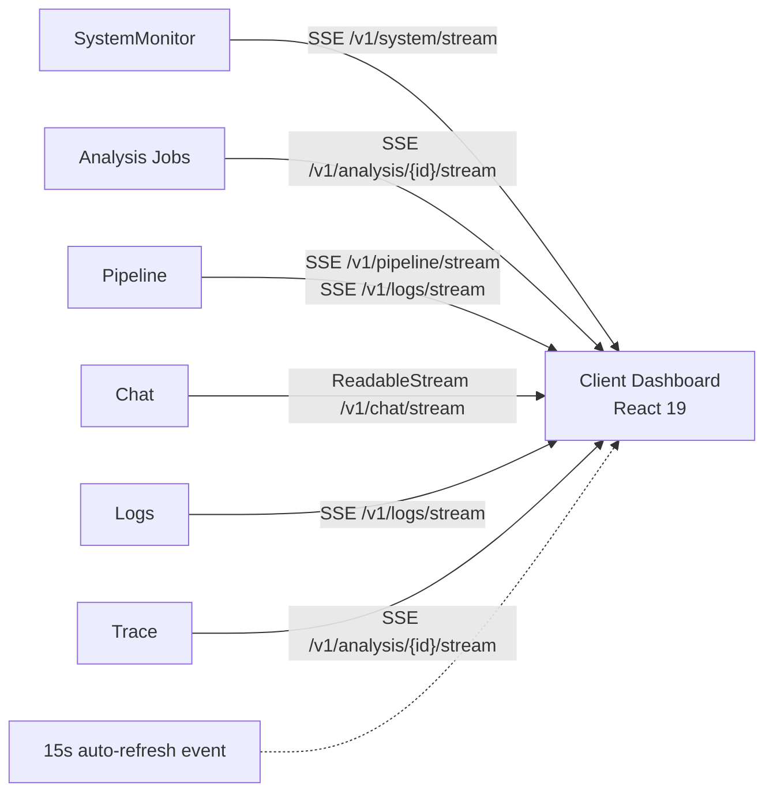

# Defense Dashboard UI Documentation

This document provides a comprehensive overview of the Defense project's web-based dashboard, located in the `dashboard/` directory.

## 1. Architecture Overview

The Defense dashboard is a modern Single Page Application (SPA) built with performance and real-time capabilities in mind.

- **Frontend Framework**: React 19
- **Build Tool**: Vite 8
- **Styling**: Tailwind CSS 3 with dark mode (`class` strategy)
- **Visualizations**: Chart.js 4 + react-chartjs-2 5
- **Icons**: Lucide React
- **Architecture**: SPA with tab-driven navigation managed via `activeTab` state in `App.jsx`
- **Real-time Communication**: Multi-channel Server-Sent Events (SSE) with ticket-based authentication
- **Available Commands**:
  - `npm run dev` (runs on port 8080)
  - `npm run build`
  - `npm test`
  - `npm run test:e2e`

## 2. Component Hierarchy

```mermaid
graph TD
    App[App.jsx] --> Header
    App --> NavTabs
    
    %% Tab Pages
    App --> Overview[Overview Page]
    App --> Posts[Posts Page]
    App --> AnalysisJobs[Analysis Jobs Page]
    App --> Reports[Reports Page]
    App --> Search[Search Page]
    App --> Agents[Agents Page]
    App --> Chat[Chat Page]
    App --> Pipeline[Pipeline Page]
    App --> Trace[Trace Page]
    App --> Warnings[Warnings Page]
    App --> Logs[Logs Page]
    
    %% Shared UI Elements
    App --> SystemMetricsChip
    App --> SystemMonitorDrawer
    
    %% Common Components used across pages
    Posts --> PostModal
    Trace --> PostModal
    Warnings --> PostModal
    
    Chat --> MarkdownView
    Agents --> MarkdownView
    
    %% Hooks and Utils
    App -.-> Hook[useSystemMetrics Hook]
    App -.-> API[api.js]
    App -.-> Utils[coverage.js / sentiment.js]
```

## 3. Authentication Flow

- **Gateway**: `Welcome.jsx` handles the login/signup process.
- **Token Storage**: Credentials (`auth_token` or `api_key`) are stored in `localStorage`.
- **API Requests**: `getAuthHeaders()` injects the token (Bearer token or X-API-Key) into all REST API calls.
- **SSE Authentication**: Handled via `POST /v1/auth/sse-ticket`. The resulting single-use ticket is passed as a query parameter to event stream endpoints.
- **Session Expiry**: An `auth-expired` custom window event triggers auto-logout upon encountering 401 Unauthorized responses.
- **Request Wrapper**: An `apiCall()` utility handles authentication injection and centralized 401 error detection.

## 4. Dashboard Tabs

### 4.1 Overview
The main entry point providing high-level metrics and system status.
- **Stat Cards**: Posts Analyzed, LLM-Routed Posts, API Calls, Corpus Coverage %, Pipeline Tokens, Total Tokens, Cost.
- **Charts**: Corpus Sentiment Doughnut, Top Topics Bar, Comment Emotions Bar, Language Distribution Horizontal Bar.
- **Token Economics Panel**: Cost analysis comparing local ($0/token) vs frontier ($5/1M) models, per-lane breakdown (post, comment, stage1, interactive, agent), per-model counters, and scale projections (1K → 1M posts).
- **APIs Used**: `GET /v1/usage`, `GET /v1/analysis/overview`
- **Updates**: Auto-refreshes via a 15s `auto-refresh` window event.

### 4.2 Posts
Intelligence explorer and bulk upload interface.
- **2-Tier Search**:
  - *Tier 1*: Instant client-side filter across loaded posts.
  - *Tier 2*: Debounced server search via `GET /v1/search`.
- **Navigation Bypass**: Exact ID queries automatically route to the specific post.
- **Upload**: Batch JSON upload via drag & drop (`POST /v1/posts/upload`).
- **Intelligence Table**: Displays Post ID (with copy button), Platform, Language, Sentiment pill, Toxicity bar, Summary, Comment Scrape Ratio (analysed/stored/total), and Timestamp.
- **Deep Inspection**: Clicking a row opens the `PostModal`.
- **Export**: PDF export (`GET /v1/reports/export_latest`) and ZIP export (`GET /v1/analysis/export`).
- **APIs Used**: `GET /v1/analysis/latest?limit=100&include=results`, `GET /v1/search`

### 4.3 Analysis Jobs
Job management and live execution tracking.
- **Job Submission**: Select Campaign ID and toggle LLM summaries.
- **Live SSE Progress**: Connects to `EventSource(/v1/analysis/{id}/stream?ticket=...)`. Handles `progress`, `stage`, `done`, `cancelled`, `error`, `connected` events.
- **Stall Detection**: Flags jobs with `>5 min` without a progress update.
- **Controls**: Track (attach SSE), Stop (graceful cancel), Resume (re-queues unanalyzed), Re-run, Download Report (PDF), Delete.
- **Safety**: Modal confirmations for destructive actions.
- **APIs Used**: `GET /v1/analysis?limit=25`, `POST /v1/analysis/run`, `POST /v1/analysis/{id}/cancel`, `POST /v1/analysis/{id}/resume`, `DELETE /v1/analysis/{id}`

### 4.4 Reports
Intelligence synthesis and PDF generation.
- **Report Types**: `trend`, `brand_mentions`, `political`, `sentiment_summary`.
- **Generation**: Generator form supporting Campaign ID selection and Grounded (LLM) toggle.
- **Report Cards**: Show title, LLM badge, executive summary, date, and PDF download link.
- **Full Viewer Modal**: Displays executive summary, raw JSON, and embedding cluster breakdown.
- **Data Integrity**: Displays honesty notices if hash-based stub vectors were used during generation.
- **APIs Used**: `GET /v1/reports?limit=20`, `POST /v1/reports`, `GET /v1/reports/{id}/export?format=pdf`

### 4.5 Search
Advanced semantic and keyword search interface.
- **Hybrid Search**: Combines PostgreSQL JSONB full-text search with pgvector 768-dim cosine similarity.
- **Semantic Toggle**: Enables vector search using `paraphrase-multilingual-mpnet-base-v2`.
- **Routing**: Exact match routing for post IDs, platform IDs, URLs, and campaign IDs.
- **Notices**: Warning banners for stub vectors.
- **Match Types**: Badges indicate Exact Identifier, Identifier Prefix, Hybrid RRF, Semantic Cosine Rank, and Keyword Match.
- **API Used**: `GET /v1/search?q={query}&campaign_id={id}&semantic={bool}`

### 4.6 Agents
MCP-backed AI agent task management.
- **9 Specialized Personas**: Analyst, Stance Intelligence, Comparative, Toxicity & Harm, Narrative Discovery, Data Quality & Audit, Report Drafting, Coverage Deep-Dive, Spike Alerting.
- **Selection**: Dropdown menu to choose agent persona.
- **Validation**: Grounding & injection status pill validates citations/quotes/stats against actual tool outputs.
- **UX Helpers**: Suggested inquiry prompts tailored per agent.
- **Execution Trace**: Viewer showing chronological tool calls with inputs and latency.
- **History**: Run history ledger with options to delete, cancel, or clear all.
- **Execution**: Polling mechanism checks status every 2,500ms until complete/failed.
- **APIs Used**: `GET /v1/agents/runs?limit=25`, `POST /v1/agents/query`, `GET /v1/agents/{runId}`, `DELETE /v1/agents/{runId}`

### 4.7 Chat
Interactive chat environment with tool provenance.
- **Multi-turn Chat**: Intelligent routing sends corpus questions to MCP agents and general questions to direct stream.
- **History Sidebar**: Conversation threads with auto-titles, timestamps, turn counts, rename, and delete capabilities.
- **Routing UX**: Visual switch markers when routing transitions between direct chat and agents.
- **Live Provenance**: `ProvenanceBar` displays backend name, model, and `ToolChip` (showing MCP server, duration, row counts).
- **Integrity**: Grounding citations and guard warnings.
- **Streaming**: Token streaming using `ReadableStream` on `/v1/chat/stream`.
- **Backends**: Selector for auto, local, or groq.
- **APIs Used**: `GET /v1/chat/conversations`, `POST /v1/chat/conversations`, `POST /v1/chat/stream`, `POST /v1/chat/agent`

### 4.8 Pipeline
High-level overview of the multi-stage ingestion process.
- **5-Stage Data Flow Diagram**: Ingestion → Stage 1 (NLP & LLM) → Router → Stage 2 (Parallel) → Assembler → Completed Queue.
- **Metrics**: Real-time display of in-flight items, backlog size, and DLQ (Dead Letter Queue) failures.
- **Diagnostics**: System execution trace terminal showing live pipeline events.
- **Streaming**: Multi-channel SSE via `EventSource(/v1/pipeline/stream)` and `EventSource(/v1/logs/stream)`.
- **Fallback**: Polling via `GET /v1/pipeline/stats` every 2 seconds if SSE fails.

### 4.9 Trace
Deep-dive debugger for individual post processing.
- **Debugger**: Re-runs a selected post through all 5 pipeline stages.
- **Selection**: Post selector dropdown.
- **Status Grid**: 5-layer live status (idle/processing/completed) for ingest, stage1, router, stage2, and assembler.
- **Visuals**: Comment sentiment doughnut chart and processing latency bar chart.
- **Output**: Canonical result viewer and event tape log.
- **Streaming**: Live updates via `EventSource(/v1/analysis/{jobId}/stream)`.

### 4.10 Warnings
Threat intelligence and alerting center.
- **Watchlist**: Alerts based on entities matching threat profiles.
- **Filtering**: Filters the corpus to show posts triggering entity rules (always or favored watchlist targets).
- **Details**: Why-it-alerted column explicitly formats alert reasoning.
- **Metrics**: Displays active alerts vs. total scanned (up to 500).
- **Export**: Generates ZIP of warning PDFs.
- **Integration**: Deep links into `PostModal` for further investigation.

### 4.11 Logs
Real-time structured server logging console.
- **Console**: Full-screen streaming interface for server logs.
- **Filters**: Level-based filtering (DEBUG, INFO, WARNING, ERROR).
- **Features**: Auto-scroll toggle, clear buffer, live stream status indicator.
- **Styling**: Monospace terminal format featuring timestamps, color-coded levels, and service tags.
- **Processing**: Automatically strips ANSI escapes and deduplicates repeating entries.
- **Performance**: Keeps a maximum of 1,000 lines in memory.
- **Streaming**: Powered by `EventSource(/v1/logs/stream?level={level}&format=json)`.

## 5. Shared Components

### PostModal
Comprehensive post inspection interface used across multiple tabs.
- **Metadata**: Core post details, caption text.
- **Analysis**: Sentiment breakdown, emotion/confidence/safety charts.
- **Comment Analysis**: 8-head comment ensemble voter matrix visualizing output from: LLM, XLM-R, DistilBERT, Twitter XLM-R, BanglaBERT, Bangla 5-cls, mBERT, ModernBERT.
- **Comment Filtering**: Filters for all, positive, negative, neutral, uncertain, disagreed.
- **Badges**: Textless/skipped comment indicators and comment scrape depth tag.
- **Exports**: Printer-ready export utilizing canvas to PNG conversion.
- **Alerts**: Watchlist alert banner if applicable.

### SystemMetricsChip
Compact resource monitor.
- **Display**: Live CPU/GPU/RAM metrics.
- **Modes**: Vertical (fixed to right edge) and horizontal (inline pill).
- **Color Scaling**:
  - Emerald: <70% utilization
  - Amber: 70-89% utilization
  - Rose: ≥90% utilization
- **Shortcut**: `Alt+M`

### SystemMonitorDrawer
In-depth hardware telemetry panel.
- **Visualizations** (Custom SVGs):
  - *RadialGauge*: 270° tachometer arc.
  - *LedEqualizerColumn*: 10-segment CPU core matrix.
  - *SegmentedDonutPlot*: RAM/Storage allocation breakdown.
  - *DiskIoWaveform*: Bidirectional read/write bars.
  - *DualNetworkWaveform*: TX/RX area chart.
  - *VerticalThermalTube*: Temperature gradient gauge.
  - *Animated Fan Turbine*: SVG spin animation correlated to actual RPM.
- **Data Display**: Live clock, hostname, OS info, uptime.
- **Export**: JSON telemetry snapshot download.
- **Updates**: SSE via `EventSource(/v1/system/stream?ticket=...)` with a 1s polling fallback.
- **History**: Maintains a rolling 20-point history buffer.

### MarkdownView
Custom markdown rendering engine.
- **Dependencies**: Zero-dependency renderer.
- **Block Elements**: Headings (h1-h6), code blocks with copy functionality, GFM tables, blockquotes, lists, horizontal rules.
- **Inline Elements**: Bold, italic, inline code.
- **Custom Parsing**: Post ID tokenization (detects patterns via regex: `cm[a-z0-9]{20,}`).

## 6. State Management & Real-Time Architecture

- **Authentication Strategy**: All SSE connections authenticate using single-use tickets generated by `POST /v1/auth/sse-ticket`.
- **Global Polling**: A 15s auto-refresh interval dispatches an `auto-refresh` window event for non-SSE tabs.
- **Keybindings**: `Alt+M` or `Ctrl+Shift+M` globally toggles the System Monitor.
- **Session Management**: An `auth-expired` custom event handles global logout actions across the application.

## 7. Build & Development

- **Development**: Run `npm run dev` to start the Vite dev server on port 8080.
- **Production**: Run `npm run build`. The Vite configuration includes manual chunk splitting (charts, react, icons, vendor) for optimal caching.
- **Testing**:
  - `npm test` executes Vitest unit tests.
  - `npm run test:e2e` executes Playwright browser tests.
- **Linting**: `npm run lint` uses Oxlint.
- **Styling**: Tailwind configuration features a custom 11-step `brand` palette (emerald base) and class-based dark mode.
- **UX**: Dark mode flash prevention is implemented via an inline `<script>` tag in `index.html`.
