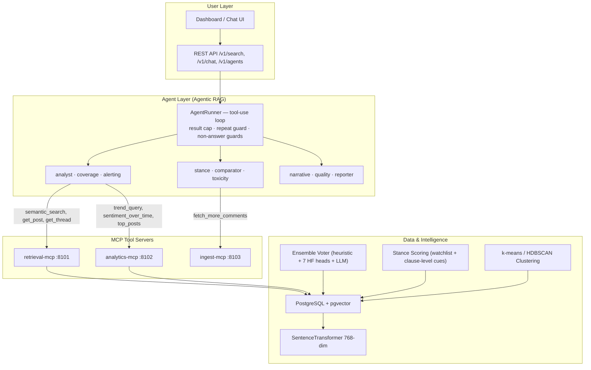

# Agentic RAG & Search — Novelty Framing & Agent Expansion Plan

> **Purpose:** Frame the agentic RAG and semantic search subsystem as a
> defensible novelty contribution, and propose additional agents that
> strengthen the thesis.

---

## 1. What You Already Have (Current Architecture)



### Current Agent Inventory

All nine are registered in
[`registry.py`](../src/defense/services/agents/registry.py), which is the source of
truth for tools and budgets — the six below the rule were the §3 proposals and
have all shipped.

| Agent | Budget | MCP Tools | Purpose |
| :--- | :---: | :--- | :--- |
| **Analyst** | 10 | `trend_query`, `sentiment_over_time`, `top_posts`, `reaction_mix`, `semantic_search`, `search_comments`, `get_post`, `get_thread`, `representative_comments` | Corpus-level Q&A — answer natural language questions about campaigns using real data |
| **Coverage** | 5 | `top_posts`, `get_post`, `fetch_more_comments` | Find under-covered posts (analyzed/total < 10%) and trigger deeper comment pulls |
| **Alerting** | 8 | `trend_query`, `sentiment_over_time`, `top_posts` | Threshold monitoring — negative sentiment >50% and avg toxicity >0.6, assessed **separately** |
| **Stance** | 12 | `stance_by_target`, `stance_over_time`, `semantic_search`, `search_comments`, `get_post`, `get_thread`, `representative_comments` | Target-dependent stance across the operator watchlist |
| **Comparator** | 15 | `trend_query`, `sentiment_over_time`, `top_posts`, `reaction_mix`, `semantic_search` | Cross-campaign and cross-period comparison |
| **Toxicity** | 14 | `top_posts`, `get_thread`, `representative_comments`, `search_comments`, `trend_query`, `semantic_search` | Harm patterns; `search_comments` lets it find a harassment pattern directly rather than walking posts |
| **Narrative** | 12 | `get_clusters`, `semantic_search`, `search_comments`, `get_post`, `trend_query`, `top_posts` | Theme and narrative discovery over embedding clusters |
| **Quality** | 8 | `coverage_stats`, `agreement_stats`, `top_posts`, `get_post` | Coverage, ensemble agreement and vector provenance — the "how reliable?" agent |
| **Reporter** | 15 | `trend_query`, `sentiment_over_time`, `top_posts`, `reaction_mix`, `semantic_search`, `get_post`, `representative_comments` | Drafts the grounded report end to end |

Every agent runs on the dedicated **`agent`** LLM role (`AGENT_LOCAL_MODEL`,
default `llama3.1:8b-16k` / `AGENT_GROQ_MODEL`, default
`llama-3.3-70b-versatile`) — not the architectural `llm_b` the §3 proposals
below still name.

### Current Search Modes

| Mode | Mechanism | Backend |
| :--- | :--- | :--- |
| **Keyword** | Case-insensitive JSONB substring matching across `post_summary`, `post_text`, `keywords`, `topics`, `themes` | PostgreSQL JSONB |
| **Semantic** | Cosine similarity via pgvector's `<=>` operator on 768-dim embeddings | PostgreSQL + pgvector |

---

## 2. Why This is a Novelty Point — Defense Framing

Most social media analysis systems do one of two things: they run batch NLP and
present dashboards, or they offer a chatbot with generic knowledge. This system
does **neither**. It implements a **grounded agentic RAG** that reasons over
its own analytical output — and it does so for **code-mixed Bangla-English-Banglish**
text, which is an under-resourced setting where out-of-the-box solutions fail.

### 2.1 The Five Defensible Novelty Claims

#### Claim 1: Domain-Specific Agentic RAG with MCP Tool Orchestration

> **"The agents don't retrieve raw documents — they retrieve structured analytical
> artifacts produced by the system's own NLP pipeline."**

| Typical RAG | This System |
| :--- | :--- |
| Retrieves raw documents from a vector store | Retrieves **structured NLP outputs** (sentiment distributions, stance verdicts, toxicity scores, topic clusters) from its own pipeline |
| Answers are grounded in document text | Answers are grounded in **quantitative analytical data** — the agent cites specific `post_id`s and real numbers |
| Single tool: vector search | **8 specialized MCP tools** across 3 servers — the LLM chooses which tools, with what filters, in what order |
| No tool budget awareness | **Budget-capped tool loop** (5–15 calls per agent) with partial-answer degradation, plus a repeat-call guard that refuses to spend the budget re-running a deterministic query |

This is an **analytical RAG**, not a document RAG. The distinction is that the
retrieval context is not the text the user might have read anyway — it is the
*system's own analysis* of that text, which only exists because the pipeline ran.

#### Claim 2: Prompt-Injection Hardened Agent Loop

> **"The system processes adversarial political content where prompt injection is
> a realistic threat, not a hypothetical."**

The agent runner ([runner.py](file:///home/bk/code/defense/src/defense/services/agents/runner.py)) implements
three defense-in-depth mitigations:

1. **`<tool_data>` wrapping** — all tool results are enclosed in explicit
   untrusted-data delimiters with `trust="untrusted"` attribute
2. **Delimiter-escape neutralization** — any `</tool_data>` forged inside the
   payload is replaced with a zero-width space variant, preventing delimiter
   breakout
3. **System-prompt policy** — the `TOOL_DATA_POLICY` in the system message
   explicitly instructs the model to treat everything inside tool_data markers
   as data written by the public, never as instructions

This is security-conscious agentic design for a **real-world adversarial corpus**
(political social media). Few academic systems address this.

#### Claim 3: Confidence-Gated Ensemble Driving RAG Quality

> **"The ensemble voter decides what data enters the vector store — and therefore
> what the RAG retrieves."**

The RAG system doesn't retrieve raw text. It retrieves analysis results that
were produced by a **multi-voter ensemble** ([ensemble.py](file:///home/bk/code/defense/src/defense/libs/ensemble.py)):

- **Heuristic** (emoji + lexicon rules — free)
- **Seven ML sentiment heads** (cheap, batched, CPU): `xlmr`, `distilbert`,
  `twitter_xlmr`, `banglabert`, `bengali_sentiment_bert`, `mbert`, `modernbert`
  — two BanglaBERT fine-tunes among them, so Bangla is judged by more than
  multilingual models that merely include it
- **LLM** (context-aware stance — expensive, only for escalated comments)

Note what "seven" does and does not buy: five of the heads are multilingual
models trained on overlapping data, so their votes are correlated and unanimity
among them is weaker evidence than seven independent readings would be. The
roster is also configurable (`STAGE2_CLASSIFIER_1..7`) and a head whose weights
are absent abstains rather than voting neutral — `stage2_cheap_voters` logs
`declared` vs `voted` so a degraded run is visible rather than silent.

The ensemble's `should_escalate()` function is the **cost lever**: it decides
which comments get the expensive LLM call based on cheap-voter disagreement,
insufficient evidence, or watchlist-entity mentions. This means:

```
Ensemble Quality → Analysis Quality → Embedding Quality → RAG Retrieval Quality
```

The quality of the RAG answers is **traceable back to the ensemble's agreement
rate**, which is a measurable, reportable quantity (`agreement_summary()`).

#### Claim 4: Multilingual Semantic Search for Code-Mixed Content

> **"The vector search operates over embeddings of Bangla-English-Banglish
> text — a setting where standard English-only models fail."**

- **Embedding model**: `paraphrase-multilingual-mpnet-base-v2` (768-dim,
  100+ languages including Bengali)
- **Query-document language mismatch**: a user can search in English and
  retrieve posts analyzed from Bangla/Banglish text
- **Provenance tracking**: every vector is tagged as `embedding_is_stub: true/false`
  so the system can honestly report when results are not semantically meaningful

This is not just "we added a vector database." The system handles the
**three-script alias problem** (English, Bangla, Banglish romanization) at
both the NLP and retrieval layers.

#### Claim 5: MCP as a Modular, Extensible Tool Protocol

> **"New analytical capabilities are added by registering MCP tools and granting
> agents access to them — not by rewriting the agent's code."**

The Model Context Protocol (MCP) architecture means:

- **Tool discovery is dynamic** — the agent fetches tool manifests at runtime
- **Tool access is permission-gated** — each agent's `tools` list in the
  registry controls what it can call
- **New tools ≠ new agent code** — adding a tool to `retrieval-mcp` or
  `analytics-mcp` and listing it in an agent's definition is all that's needed
- **Each MCP server is independently deployable** — containerized, with its
  own health check and stub mode

---

## 3. Proposed New Agents

The following agents extend the system's capability while staying within the
existing MCP architecture. Each one requires: (a) MCP tools it will call,
(b) a system prompt, (c) a registry entry.

### 3.1 Stance Intelligence Agent

**Purpose:** Deep-dive into target-dependent stance patterns — the system's
most novel analytical feature.

```python
STANCE_AGENT = AgentDefinition(
    name="stance",
    description="Analyze target-dependent stance patterns across campaigns",
    system_prompt="""You are a stance analysis expert. You investigate how
    public opinion distributes across specific targets (political figures,
    organizations, policies) in social media campaigns.

    When answering:
    1. Always use tools to retrieve real stance data — never fabricate numbers
    2. Compare stance distributions across targets when relevant
    3. Identify stance asymmetries (e.g., "Entity A gets 60% opposing but
       Entity B gets 80% supportive in the same comment threads")
    4. Report the method provenance (LLM vs deterministic) for each finding
    5. Flag watchlist targets with high opposing stance as potential crisis signals
    """,
    tools=[
        "stance_by_target",        # NEW tool needed
        "stance_over_time",        # NEW tool needed
        "semantic_search",
        "get_post",
        "get_thread",
        "representative_comments",
    ],
    llm_role="llm_b",
    max_tool_calls=10,
)
```

**New MCP Tools (implemented):**

| Tool | Server | Source of truth |
| :--- | :--- | :--- |
| `stance_by_target` | **retrieval-mcp** | Folds `analysis_results.result->'comment_analysis'->'target_stances'` (Postgres JSONB) across the latest analysis of each post, per `target_id` |
| `stance_over_time` | **retrieval-mcp** | Same rollup bucketed by `date_trunc(granularity, created_at)`; one row per (period, target) |

> [!IMPORTANT]
> These live in **retrieval-mcp, not analytics-mcp**, because the per-entity
> rollup `aggregate_target_stances()` writes is stored in Postgres and nowhere
> else. ClickHouse `analysis_events` carries post-level **sentiment** only, and
> stance-toward-an-entity is a deliberately separate judgement from
> sentiment-toward-the-post ([prompts.py](file:///home/bk/code/defense/src/defense/services/workers/stage2_llm/prompts.py) §"t" vs "s"): a comment can praise a
> post that attacks an entity. Deriving one from the other would report a number
> the pipeline never measured — and it would report it under the label of the
> system's most novel component.
>
> Targets nobody mentioned are **absent, not zero-filled**, and each row carries
> its own `method` (`llm` / `deterministic`) so a finding states its provenance.

**Why it's valuable for the defense:** This agent makes the **target-dependent
stance detection** — already identified as the system's most novel component —
*interactive*. The examiner can ask "Who is most opposed in campaign X?" and
get a grounded, citation-backed answer.

---

### 3.2 Comparative Analysis Agent

**Purpose:** Cross-campaign and cross-post comparison — the question examiners
will ask.

```python
COMPARATIVE_AGENT = AgentDefinition(
    name="comparator",
    description="Compare sentiment, toxicity, and engagement across campaigns or time periods",
    system_prompt="""You are a comparative social media analyst. You specialize
    in comparing patterns across campaigns, time periods, and post types.

    When answering:
    1. Always retrieve data from BOTH sides of the comparison
    2. Present numbers side by side — never summarize one side without the other
    3. Compute deltas and percentage changes when comparing time periods
    4. Identify statistically meaningful differences vs noise
    5. Use charts-friendly output: tables with clear column headers
    """,
    tools=[
        "trend_query",
        "sentiment_over_time",
        "top_posts",
        "reaction_mix",
        "semantic_search",
    ],
    llm_role="llm_b",
    max_tool_calls=15,  # comparisons need more tool calls (2x data)
)
```

**Why it's valuable:** Examiners will ask "How does Campaign A compare to
Campaign B?" The current analyst agent can do this, but a dedicated comparator
with a higher tool budget and comparison-focused system prompt will produce
better structured answers.

---

### 3.3 Toxicity & Harm Detection Agent

**Purpose:** Focused investigation of toxic content patterns, enabling
moderation-oriented insights.

```python
TOXICITY_AGENT = AgentDefinition(
    name="toxicity",
    description="Deep-dive into toxicity patterns, hate speech, and harmful content",
    system_prompt="""You are a content safety analyst investigating toxicity
    patterns in social media comment threads.

    When answering:
    1. Use tools to identify posts with highest average toxicity scores
    2. Distinguish between different types of harmful content:
       - Personal attacks on public figures
       - Communal/religious hate speech
       - Coordinated harassment patterns
       - Incitement to violence
    3. Look for toxicity clustering: are toxic comments concentrated on
       specific posts, or distributed?
    4. Report the comment-level toxicity scores, not just post averages
    5. Always include representative examples (quoted, not paraphrased)
    6. Flag potential content-moderation priorities
    """,
    tools=[
        "top_posts",
        "get_thread",
        "representative_comments",
        "trend_query",
        "semantic_search",
    ],
    llm_role="llm_b",
    max_tool_calls=10,
)
```

**MCP Tool Enhancement (implemented):** `top_posts` takes a `min_toxicity`
parameter (0.0–1.0) that restricts the ranking to posts at or above a toxicity
threshold.

**Why it's valuable:** Content moderation is a major real-world application of
social media analysis. This agent provides an **actionable moderation workflow**
grounded in real data.

---

### 3.4 Narrative & Theme Discovery Agent

**Purpose:** Identify emerging narratives and topic clusters using the
embedding-based clustering system that already exists.

```python
NARRATIVE_AGENT = AgentDefinition(
    name="narrative",
    description="Discover emerging narratives, themes, and topic clusters in campaigns",
    system_prompt="""You are a narrative intelligence analyst. You identify
    emerging themes, topic clusters, and narrative patterns in social media
    campaigns.

    When answering:
    1. Use cluster data to identify thematic groups of posts
    2. Name each cluster with a human-readable theme label
    3. Quantify each theme: how many posts, what sentiment distribution,
       which targets are mentioned
    4. Identify narratives that are growing vs declining over time
    5. Look for counter-narratives: opposing themes that emerge in response
       to each other
    6. Connect themes to stance: which narratives are associated with
       support/opposition for which targets?
    """,
    tools=[
        "get_clusters",
        "semantic_search",
        "get_post",
        "trend_query",
        "top_posts",
    ],
    llm_role="llm_b",
    max_tool_calls=12,
)
```

**New MCP Tool Needed:**

| Tool | Server | Implementation |
| :--- | :--- | :--- |
| `get_clusters` | retrieval-mcp | Fetch embeddings from pgvector → run `cluster_embeddings()` → return cluster summaries with representative post IDs, each flagged `is_stub` when any member vector is a hash stub |

**Why it's valuable:** This agent **directly uses** the clustering module
([clustering.py](file:///home/bk/code/defense/src/defense/libs/clustering.py)) which already exists but is only consumed by reports. Making
it agent-accessible means the user can interactively explore "what are people
talking about?" — a question the batch report answers statically, but the agent
answers dynamically.

---

### 3.5 Data Quality & Provenance Agent

**Purpose:** Self-audit — let the system explain its own analytical confidence
and data coverage.

```python
QUALITY_AGENT = AgentDefinition(
    name="quality",
    description="Audit data quality, coverage, ensemble agreement, and provenance",
    system_prompt="""You are a data quality auditor for the social media analysis
    pipeline. Your job is to help users understand how trustworthy the analysis is.

    When answering:
    1. Report coverage: what fraction of posts/comments have been analyzed?
    2. Report ensemble agreement: how often did the voters agree? What was
       the unanimous share, abstention rate, single-voter rate?
    3. Report method provenance: what fraction of labels came from the LLM
       vs the cheap voters vs the heuristic?
    4. Identify posts where the analysis might be unreliable:
       - Low coverage (few comments analyzed)
       - High abstention rate (voters disagreed)
       - Stub embeddings (semantic search results not meaningful)
    5. Flag data-quality anomalies: coverage > 100%, missing embeddings,
       broken analysis results
    6. Be honest about limitations — this is an audit, not a sales pitch
    """,
    tools=[
        "coverage_stats",
        "agreement_stats",
        "top_posts",
        "get_post",
    ],
    llm_role="llm_b",
    max_tool_calls=8,
)
```

**New MCP Tools (implemented):**

| Tool | Server | Source of truth |
| :--- | :--- | :--- |
| `coverage_stats` | **retrieval-mcp** | Postgres: `posts` is the denominator for "what fraction is analysed", `analysis_results` supplies comment coverage, `coverage_anomaly` and `embedding_is_stub` |
| `agreement_stats` | **analytics-mcp** | ClickHouse `comment_sentiments` — the **per-comment** table, where `label_agreement` / `label_source` / `method` actually land |

Why those two servers: the analysed-post fraction needs the `posts` table as a
denominator and the stub-embedding count needs `analysis_results.embedding_is_stub`
— neither exists in ClickHouse, which only ever receives rows for posts that were
already analysed (so "coverage" computed there is 100% by construction). Conversely
the abstention and single-voter rates cannot be recovered from the one averaged
figure `analysis_events` stores per post; they are derived per comment:

| Reported | Derived from |
| :--- | :--- |
| `unanimous_share` | `method='ensemble'` (≥2 voters) **and** `label_agreement ≈ 1.0` |
| `abstained_share` | `sentiment='uncertain'` with `label_agreement > 0` |
| `unread_share` | `sentiment='uncertain'` with `label_agreement = 0` — nobody read it |
| `single_voter_share` | one labeller spoke, so `method` is that labeller's name |
| `propagated_share` | label copied from a near-duplicate's representative |

Every field comes from a column. No constants: an audit tool that fills its gaps
with plausible numbers audits nothing.

**Why it's valuable for the defense:** This is **meta-transparency** — the
system can explain its own confidence. When an examiner asks "How reliable are
these numbers?", the quality agent answers with real data, not hand-waving. It
also demonstrates the provenance discipline (§5.3) that runs through the entire
system.

---

### 3.6 Report Drafting Agent

**Purpose:** Automated generation of structured analytical reports from corpus
data.

```python
REPORT_AGENT = AgentDefinition(
    name="reporter",
    description="Draft structured analytical reports from campaign data",
    system_prompt="""You are an analytical report writer. Given a campaign and
    a focus area, you draft a structured report with sections, findings, and
    data citations.

    Report structure:
    1. Executive Summary (2-3 sentences)
    2. Key Findings (numbered, each with data citation)
    3. Sentiment Distribution (with actual percentages)
    4. Top Themes / Narratives
    5. Notable Posts (most engaged, most toxic, most discussed)
    6. Stance Summary (if watchlist targets are configured)
    7. Data Quality Notes (coverage, agreement rate, method mix)

    Rules:
    - Every claim must cite a post_id or an aggregate statistic from a tool
    - Use markdown formatting for structure
    - Include a "Methodology" footnote explaining which models produced the data
    """,
    tools=[
        "trend_query",
        "sentiment_over_time",
        "top_posts",
        "reaction_mix",
        "semantic_search",
        "get_post",
        "representative_comments",
    ],
    llm_role="llm_b",
    max_tool_calls=15,
)
```

**Why it's valuable:** This demonstrates the **end-to-end value chain**: raw
social media → NLP pipeline → structured data → agent-generated report. The
examiner sees the entire flow in one artifact.

---

## 4. Implementation Priority

| Priority | Agent | Effort | New MCP Tools | Defense Impact |
| :---: | :--- | :--- | :--- | :--- |
| 🔴 P0 | **Stance Intelligence** | Medium | 2 new tools | Directly showcases the most novel component |
| 🔴 P0 | **Data Quality** | Medium | 2 new tools | Answers the examiner's "how reliable?" question |
| 🟡 P1 | **Narrative Discovery** | Low | 1 new tool (wraps existing `clustering.py`) | Shows embedding clustering in action |
| 🟡 P1 | **Comparative Analysis** | Low | 0 (uses existing tools) | Handles the "compare campaigns" question |
| 🟢 P2 | **Report Drafting** | Low | 0 (uses existing tools) | End-to-end demo value |
| 🟢 P2 | **Toxicity Agent** | Low | 0 (minor enhancement) | Content moderation application angle |

All six are implemented and registered in
[`registry.py`](../src/defense/services/agents/registry.py).

> [!NOTE]
> **The §3 code blocks are the original proposals, kept as the design record.**
> What shipped differs in three ways, and `registry.py` is authoritative:
> `llm_role` is **`agent`**, not `llm_b`; the budgets are the ones in the §1
> inventory table above; and the system prompts have been rewritten against live
> failures — most heavily `alerting` (which now names which tool serves which
> threshold, because it was asserting toxicity verdicts from
> `sentiment_over_time`, a tool with no toxicity field) and `stance` (which is
> now told the watchlist is a closed list it cannot see and must not guess at).
> §7 of [RAG_STATE_AND_ROADMAP.md](RAG_STATE_AND_ROADMAP.md#section-9--the-agent-layer-once-real-retrieval-was-behind-it)
> records the eight failures those rewrites answer.

### 4.1 Honesty Invariants for Agent-Facing Tools

The claims in §2 (provenance tracking, ensemble-traceable quality) only hold if a
tool never hands the agent a number the pipeline did not measure. The agent has
no way to tell a measurement from a plausible-looking constant, and neither does
an examiner reading the answer. So every tool above obeys four rules:

1. **No error-path substitution.** A database failure raises. The runner records
   the error and the agent says it could not get the data — it does not silently
   receive synthetic figures that look exactly like real ones.
2. **Stub output is labelled.** Data produced in stub mode carries `is_stub: true`
   (and a note saying so) in the payload itself, not just in a log line.
3. **No filled gaps.** A field that cannot be derived from a column is not
   reported. `agreement_stats` derives all five of its shares per comment; nothing
   is a literal.
4. **No silent scope widening.** A `campaign_id` that is not an id is rejected
   rather than dropped: a corpus-wide answer wearing a campaign label reads as
   correct and is not. Explicit `'all'` is honoured and logged as such.

---

## 5. How to Present in the Defense

### Slide Structure

```
Slide 1: "From Batch NLP to Interactive Intelligence"
         Show the pipeline → storage → agent → answer flow

Slide 2: "Agentic RAG Architecture"
         The MCP tool-use loop diagram (system prompt → tool calls → data
         retrieval → grounded answer)

Slide 3: "Not Document RAG — Analytical RAG"
         Side-by-side: standard RAG retrieves text chunks,
         this system retrieves structured NLP outputs

Slide 4: "Security in Adversarial Corpora"
         The prompt-injection hardening: <tool_data> wrapping,
         delimiter escape, system-prompt policy

Slide 5: "Agent Ecosystem"
         Table of all agents with their tool permissions and use cases

Slide 6: "Live Demo"
         Ask the Analyst Agent a question, show the tool-call trace,
         show the cited post_ids in the answer
```

### Key Phrases for the Defense

Use these when explaining:

- **"Analytical RAG, not Document RAG"** — the agents retrieve the system's
  own NLP outputs, not raw documents
- **"Tool-use loop with budget caps"** — the agent reasons about which tools
  to call, in what order, subject to a cost ceiling
- **"Prompt-injection aware"** — the system processes adversarial political
  content and wraps tool data in untrusted-data delimiters
- **"MCP modularity"** — new analytical capabilities are tool registrations,
  not code changes to the agent
- **"Provenance-tracked throughout"** — every number the agent cites can be
  traced to its source model and agreement rate

### Anticipated Examiner Questions & Answers

| Question | Answer |
| :--- | :--- |
| *"How is this different from just putting ChatGPT on a database?"* | The agents use **specialized MCP tools** with typed parameters — `semantic_search(query, campaign_id, sentiment_filter)` is not a freeform SQL query. The tools enforce tenant isolation, rate limits, and data contracts. The agent loop has a budget cap, prompt-injection hardening, and usage tracking. |
| *"Is the RAG actually retrieval-augmented or just a chatbot?"* | It is genuinely retrieval-augmented: the agent **must call tools** to answer analytical questions. The system prompt forbids fabricating statistics. The answer includes `citations` (post_ids extracted from tool results). Without the tools, the agent has no data. |
| *"What happens when the semantic search uses stub embeddings?"* | The system tracks `embedding_is_stub` on every vector. When a semantic search runs over stub vectors, a warning is logged (`semantic_search_over_stub_vectors`), the search result includes `embedding_is_stub: true`, and the agent's answer reflects that the results are ordered by recency, not semantic relevance. |
| *"How do you prevent the agent from hallucinating?"* | Prompting is the weakest layer, so it is not the answer. (1) IDs and quotes asserted in the answer are checked against what the tools actually returned — and against what the model was **shown**, since a result trimmed to fit the context is not grounding. Unverified ones are appended to the answer as a warning block, not silently dropped. (2) A run is only `completed` if the answer answers something: code output, payload narration, self-narration and the empty-template shape each fail it. (3) The mirror case is caught too — an answer that says "no post-level data was retrieved" in a run that retrieved ten post_ids gets contradicted in writing. (4) An off-watchlist `target_id` is rejected with the valid ids named, so "nobody tracks that entity" cannot be reported as "the corpus is silent". (5) The `<tool_data trust="untrusted">` wrapper keeps retrieved comment text from reading as instructions. (6) The budget cap prevents infinite loops. |
| *"Can you add new analytical capabilities without changing the agent code?"* | Yes — add an MCP tool to a server, add the tool name to the agent's `tools` list in `registry.py`. The agent discovers the tool manifest at runtime. No changes to `runner.py` or the agent loop. |

---

## 6. What Makes This Publishable

The combination of these elements in one system is, to our knowledge, not
present in existing literature on Bangla/Banglish social media analysis:

1. **Agentic RAG over structured NLP outputs** (not raw text retrieval)
2. **MCP-based tool orchestration** with budget-capped reasoning loops
3. **Prompt-injection hardening** for adversarial political content
4. **Multilingual semantic search** (pgvector) for code-mixed Bangla-English-Banglish
5. **Ensemble-driven retrieval quality** — the RAG's data quality is traceable
   to the ensemble's agreement rate
6. **Target-dependent stance** as an interactive, agent-queryable capability
7. **Provenance tracking** from embedding generation through agent answers

> [!IMPORTANT]
> The strongest defense angle is **not** "we built a RAG system" (everyone has).
> It is: **"we built an analytical intelligence layer where agents reason over
> structured NLP outputs from a code-mixed corpus, with prompt-injection
> hardening, provenance tracking, and budget-aware tool orchestration — and
> the retrieval quality is a measurable function of the ensemble's agreement
> rate."**

---

## 7. Quick Implementation Guide

### Adding a New Agent (3 Steps)

**Step 1:** Define the agent in [registry.py](file:///home/bk/code/defense/src/defense/services/agents/registry.py):

```python
NEW_AGENT = AgentDefinition(
    name="my_agent",
    description="What this agent does",
    system_prompt=MY_SYSTEM_PROMPT,
    tools=["tool_a", "tool_b"],
    llm_role="llm_b",
    max_tool_calls=10,
)

# Add to registry
AGENT_REGISTRY = {
    a.name: a for a in [
        ANALYST_AGENT, COVERAGE_AGENT, ALERTING_AGENT,
        NEW_AGENT,  # ← add here
    ]
}
```

**Step 2:** Add any new MCP tools to the appropriate server
(e.g., [analytics_mcp/server.py](file:///home/bk/code/defense/src/defense/mcp_servers/analytics_mcp/server.py)):

```python
@mcp.tool
async def my_new_tool(
    campaign_id: Annotated[str | None, Field(description="...")] = None,
) -> list[dict]:
    """Tool description for the agent's manifest."""
    # ... SQL query against analysis_results ...
```

**Step 3:** Invoke via the API:

```bash
POST /v1/agents/run
{
  "agent": "my_agent",
  "query": "What are the stance patterns for Target X?",
  "campaign_id": "cm..."
}
```

The existing `AgentRunner` handles the tool-use loop, budget cap,
prompt-injection wrapping, and citation extraction automatically.
