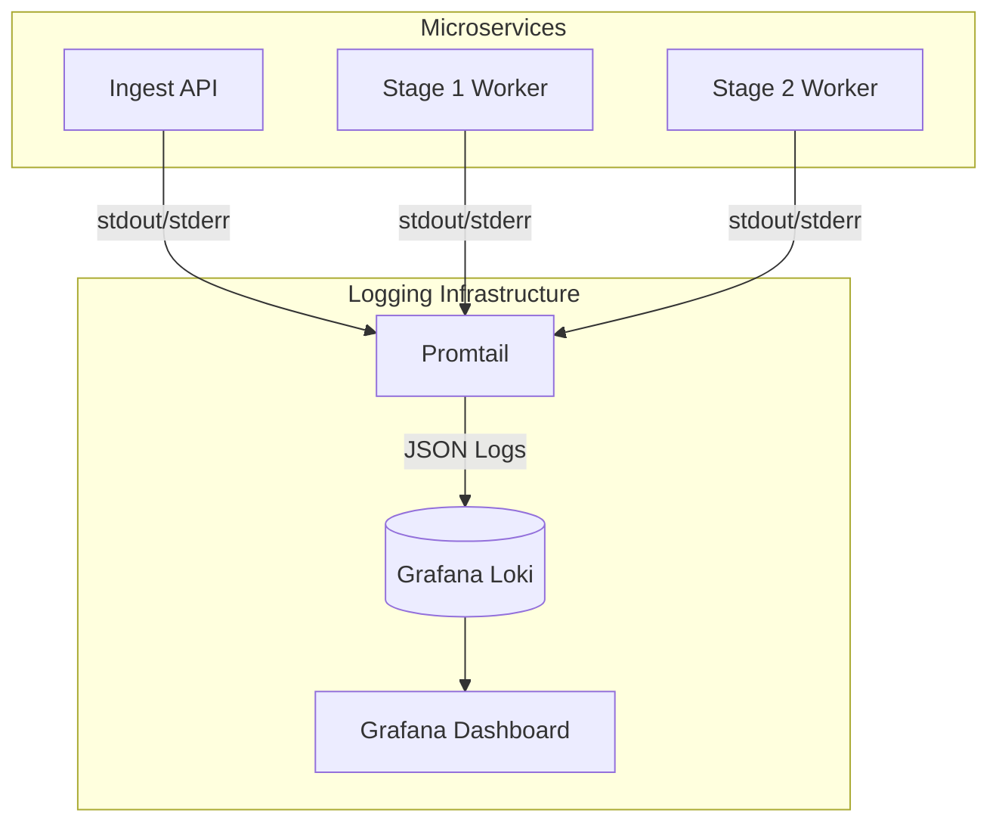

# System Monitor & Observability Documentation

The Defense platform provides a comprehensive monitoring and observability stack spanning:
- Real-time hardware telemetry (CPU, GPU, VRAM, RAM, Storage, Network, Cooling)
- Pipeline throughput and queue depth monitoring
- Structured logging with centralized aggregation
- Distributed tracing
- LLM token usage and cost tracking

---

## 1. Monitoring Architecture Overview

```mermaid
graph TD
    subgraph Frontend [React Dashboard]
        SMD[SystemMonitorDrawer]
        SMC[SystemMetricsChip]
        LP[Logs Page]
        PP[Pipeline Page]
    end

    subgraph Backend [FastAPI Backend]
        API_Sys[/v1/system/stream]
        API_Pipe[/v1/pipeline/stream]
        API_Log[/v1/logs/stream]
        Usage[/v1/usage]
    end

    subgraph Data & Aggregation
        Redis[(Redis Streams\n& Pub/Sub)]
        Prom[Prometheus]
        Loki[Loki]
        Jaeger[Jaeger]
    end

    subgraph Workers [Pipeline Stages]
        W1[Stage 1 Workers]
        W2[Stage 2 Workers]
    end

    SMD <--> API_Sys
    SMC <--> API_Sys
    PP <--> API_Pipe
    LP <--> API_Log

    W1 --> Redis
    W2 --> Redis
    
    API_Sys --> Prom
    API_Pipe --> Redis
    API_Log --> Loki
    
    W1 -. Traces .-> Jaeger
    W2 -. Traces .-> Jaeger
```

---

## 2. Hardware Telemetry

### Dashboard System Monitor Drawer
The SystemMonitorDrawer (`dashboard/src/components/SystemMonitorDrawer.jsx`) is a full-featured hardware telemetry panel.

#### Custom SVG Visualizations (7 types):
1. **RadialGauge** — 270° tachometer arc gauge with drop shadow glow (used for CPU/GPU overall load)
2. **LedEqualizerColumn** — 10-segment LED matrix showing individual CPU core utilization
3. **SegmentedDonutPlot** — Multi-segment donut for RAM breakdown (Used/Buffers/Cache/Free) and Storage (Used/Available)
4. **DiskIoWaveform** — Bidirectional vertical bar waveform: Read (up/emerald) vs Write (down/amber)
5. **DualNetworkWaveform** — Smooth dual-path area chart: TX sent vs RX received
6. **VerticalThermalTube** — Temperature gauge with dynamic gradient (emerald → amber → rose)
7. **Animated Fan Turbine** — SVG rotation animation keyed to actual RPM readings

#### Metrics Collected:
- **CPU:** Overall load %, per-core utilization array, frequency (MHz), temperature (°C)
- **GPU:** Utilization %, VRAM used/total (GB), temperature (°C), fan speed (RPM)
- **RAM:** Used/Buffers/Cached/Available/Total (GB), swap usage
- **Storage:** Used/Available/Total (GB), Read/Write I/O rates (MB/s)
- **Network:** TX/RX rates (KB/s), packet counts
- **Cooling:** Fan RPM, temperature sensors
- **System:** Hostname, OS name, uptime, kernel version

### System Metrics Chip
The SystemMetricsChip (`dashboard/src/components/SystemMetricsChip.jsx`):
- Floating vertical strip pinned to right viewport edge
- Displays CPU/GPU/RAM load with color-coded severity:
  - Emerald (<70%) — Normal
  - Amber (70-89%) — Warning  
  - Rose (≥90%) — Critical
- `Alt+M` keyboard shortcut to open full drawer
- Pulsing live beacon indicator

### `useSystemMetrics` Hook
Custom React hook (`dashboard/src/hooks/useSystemMetrics.js`):
- **Primary:** SSE stream via `EventSource(/v1/system/stream?ticket=...)`
- **Fallback:** HTTP polling `GET /v1/system/stats` every 3,000ms (configurable `pollInterval`)
- **Data extraction:** `extractSystemMetrics(data)` normalizes raw telemetry into `{ cpu, gpu, ram }` percentages
- **Resilience:** Automatic SSE→polling failover; safe cleanup on unmount via `isMountedRef`
- Returns: `{ metrics, isLive, loading, error, refresh }`

### Backend Endpoints
- `GET /v1/system/stats` — Returns current hardware metrics snapshot (JSON)
- `GET /v1/system/health` — The cheap version: per-component up/down + status, for a
  header chip or a probe. Use this rather than `/stats` when you only need liveness —
  `/stats` shells out for GPU and Docker state and is materially more expensive.
- `GET /v1/system/stream?ticket={ticket}` — SSE stream of `stats` events (real-time push)
- Authentication: SSE ticket obtained via `POST /v1/auth/sse-ticket` (single-use)

All three live in [`api/routers/system.py`](../src/defense/services/api/routers/system.py)
and are listed in the endpoint reference at [endpoints.md](endpoints.md) §3b.

---

## 3. Pipeline Monitoring

### Pipeline Dashboard Page
The Pipeline page (`dashboard/src/pages/Pipeline.jsx`) shows real-time data flow.

#### 5-Stage Architecture Visualization:
```
Ingestion → Stage 1 (NLP & LLM) → Router → Stage 2 (Parallel) → Assembler → Completed
```

Each stage shows:
- **In-flight count:** Currently processing items
- **Backlog:** Queued items waiting
- **DLQ (Dead Letter Queue):** Failed items
- **Stage latency (ms)**

#### SSE Stream Topology

```mermaid
graph LR
    subgraph Browser
        EH[EventSource Handler]
    end

    subgraph Backend
        Router[/v1/pipeline/stream]
        Router2[/v1/logs/stream]
    end

    subgraph Message Broker
        Redis[Redis Streams & Pub/Sub]
    end

    EH -- "GET /pipeline/stream" --> Router
    EH -- "GET /logs/stream" --> Router2
    
    Router -- "Subscribe" --> Redis
    Router2 -- "Subscribe" --> Redis

    W[Workers] -- "Publish updates" --> Redis
```

- `GET /v1/pipeline/stream` — Pipeline stage metrics (backlog, in_flight, dead_letter, stage_latencies_ms)
- `GET /v1/logs/stream?level=DEBUG&format=json` — Execution trace for the live terminal
- Fallback: `GET /v1/pipeline/stats` polling every 2,000ms

### Pipeline Statistics API
- `GET /v1/pipeline/stats` — Returns queue depths per stream:
  - `ingestion:queue`
  - `nlp:stage1:queue`
  - `router:queue`
  - `llm:stage2:queue`
  - `assembler:queue`

---

## 4. Structured Logging

### Dashboard Logs Console
The Logs page (`dashboard/src/pages/Logs.jsx`):
- Full-screen streaming terminal for server structured logs
- Level filter dropdown: DEBUG, INFO, WARNING, ERROR
- Auto-scroll toggle with manual scroll override
- Clear buffer button
- Live stream status indicator (green dot)
- Max 1,000 log entries in memory
- ANSI escape code stripping via regex
- Deduplication via `seenRef` Set (prevents duplicates during backfill→live transition)

### SSE Log Stream Protocol
- `GET /v1/logs/stream?ticket={ticket}&level={level}&format=json`
- Event type: `log`
- Frame schema:
  ```json
  {
    "timestamp": "2026-08-22T06:30:00.123Z",
    "level": "INFO",
    "event": "post_analyzed",
    "service": "stage2-llm",
    "module": "ensemble",
    "trace_id": "abc123",
    "post_id": "cm...",
    "tenant_id": "default",
    "message": "Ensemble merge completed"
  }
  ```

### Backend Logging Architecture (Structlog)
- All services use `structlog` with JSON rendering
- Standard processors: `add_log_level`, `TimeStamper(fmt='iso')`, `JSONRenderer()`
- Context variables: `trace_id`, `post_id`, `tenant_id`, `stage`, `service`
- Log sink isolation between services (each service has its own logger namespace)
- Redis buffer: `logs:recent` (backfill) + `logs:live` (pub/sub channel)

### Log Aggregation Pipeline



- **Centralized Logging:** Loki + Promtail
- Promtail scrapes container stdout/stderr
- Config: `deploy/promtail-config.yml`
- Labels: `service`, `level`, `tenant_id`
- Loki endpoint in Docker Compose stack

---

## 5. Metrics & Monitoring (Prometheus + Grafana)

### Prometheus Configuration
- Config: `deploy/prometheus.yml`
- Scrape targets: API service, worker services, MCP servers

### Key Metrics to Monitor:

#### Pipeline Throughput
- Posts processed total (per stage)
- Processing latency histograms (p50, p95, p99)
- Queue depth per Redis Stream
- Dead letter queue counts

#### LLM Performance
- Tokens in/out by backend and model
- Latency per LLM call (by role: stage1, stage2, summary, agent, interactive)
- Rate limit 429 hit counts
- Circuit breaker state transitions

#### Ensemble Agreement
- `unanimous_share` — fraction of comments where all voters agreed
- `abstained_share` — fraction where voters failed to load/run
- `single_voter_share` — fraction with only 1 voter (no agreement possible)
- `unread_share` — comments no model read

#### System Resources
- CPU/GPU/RAM utilization (from `/v1/system/stats`)
- VRAM usage (critical for local LLM serving)
- Network I/O rates

### Grafana Dashboards
- **Pipeline Overview:** stage throughput, queue depths, DLQ trends
- **Cost & Token Tracker:** per-backend token counts, cost projections
- **Ensemble Agreement:** voter agreement rates, abstention trends
- **System Health:** CPU/GPU/RAM, VRAM contention monitoring

---

## 6. Distributed Tracing (OpenTelemetry + Jaeger)

### Trace Propagation
Span hierarchy: `Ingest → Worker (Stage 1) → Router → Worker (Stage 2) → Assembler → DB Write`
- Trace IDs carried through Redis Stream message envelopes
- Each stage creates a child span
- `libs/tracing.py` provides trace context utilities

### Jaeger UI
- Port: `:16686` (in Docker Compose stack)
- Search by `trace_id`, `service` name, or time range
- Visualize full request lifecycle across all pipeline stages

---

## 7. Cost & Usage Telemetry

### Token Usage API
`GET /v1/usage` returns comprehensive token accounting:
- **Per-backend:** local (cost $0) vs groq (per-token pricing)
- **Per-model:** token counts per model name
- **Per-lane:** `post`, `comment`, `stage1`, `interactive`, `agent`
- **Pipeline vs interactive:** `pipeline_tokens` isolates per-post processing from chat/agent usage

### LLM Usage Tracking (`libs/llm/usage.py`)
- Every `LLMClient` call records tokens consumed
- Lane assignment based on calling context
- Circuit breaker in `libs/llm/circuit.py` for backend failure protection
- Rate limiting in `libs/ratelimit.py`

---

## 8. Dead Letter Queue (DLQ)

### DLQ Management (`libs/dlq.py`)
- Failed messages moved to per-stage DLQ streams
- Dashboard Pipeline page shows DLQ counts per stage
- Configurable retry policies
- DLQ messages retain full original payload + error details

---

## 9. Health Checks

### Service Health Endpoints
- API liveness: `GET /v1/health`
- API readiness: `GET /v1/ready` — checks Postgres **and** Redis and returns
  `{"status": "ready", "postgres": "ok", "redis": "ok"}`. This is the one to wire to
  a Kubernetes readiness probe; `/v1/health` answers even when the datastores are down.
- Component detail: `GET /v1/system/health` (§2)
- Analytics MCP: `GET :8110/health` (host port 8110 → container 8100 under Compose, because 8100 is commonly taken on dev hosts)
- Retrieval MCP: `GET :8101/health`
- Ingest MCP: `GET :8102/health`

### Dashboard Backend Status
- Header shows LLM Backend pill (Groq/Local vLLM/OpenAI/Auto)
- Header shows NLP Backend pill (model name)
- Bottom status bar: "System Status: Online" + API endpoint
- System Metrics Chip: live pulsing beacon

---

## 10. Kubernetes Observability

### KEDA Autoscaling
- Config: `deploy/k8s/keda-scaledobjects.yaml`
- Trigger: Redis Stream `lagCount`
- Scales workers independently per stage based on queue backlog

### Network Policies
- Config: `deploy/k8s/networkpolicy.yaml`
- Restricts inter-service communication to required paths only

---

## 11. Related documents

- [PIPELINE.md](PIPELINE.md) — the streams whose depths and DLQs this monitors, and the progress-event contract
- [JOBS.md](JOBS.md) — job counters and the SSE progress channel
- [LLM_BACKENDS.md](LLM_BACKENDS.md) §4 — the usage counters `GET /v1/usage` reads, and the five lanes
- [DASHBOARD_UI.md](DASHBOARD_UI.md) — the UI surfaces these endpoints feed
- [AUTH.md](AUTH.md) §4 — SSE tickets, required by `/v1/system/stream`
- [deployment.md](deployment.md) · [infrastructure.md](infrastructure.md) — the K8s and GPU context
