# Upstream Data Contract — Post-with-Details Payload & Integration

**Authoritative description of the real input the smart layer consumes**, how it
integrates with the existing platform, and how every upstream field maps into our
analysis. The real source of truth is **[posts_with_details.json](../posts_with_details.json)**
(50 posts with their comments embedded). This supersedes any earlier sketched
schema (`{post_id, platform, text, author}`) and the earlier **two-endpoint
(separate Post API + Comment API)** model — the upstream now returns a **single
post-with-details payload** with comments, engagement, reactions, and shares
embedded. Worked input→output runs are in [examples.md](examples.md); our REST
contracts are in [api_design.md](api_design.md); the canonical output schema is in
[architecture.md](architecture.md) §6.

> **Implementation companion:** how a payload is pulled, validated, normalized,
> deduplicated and enqueued — and which of the golden rules below is enforced
> where — is [INGESTION.md](INGESTION.md).


---

## 0. The big picture — a service on top of an existing platform

The smart layer is **not** the scraper. It is a downstream analysis service that
sits next to a **pre-existing social-media monitoring platform** (the "upstream").
That platform scrapes posts and their comments (Facebook in this sample; others by
URL host, §3), persists them, and exposes them over REST as a **post-with-details**
resource: each post object carries its **embedded `comments[]`**, a nested
**`engagement`** object, a **`reactionBreakdown`**, and a sample of **`sampleShares`**
(see §1). Records are keyed by **stable CUIDs** (e.g. `cmosjpp9305n0u9tskgmd1c4k`);
the post `id` and each `comments[].id` are the join/idempotency keys.

The **unit of analysis is "a post together with its comment thread."** Because the
comments are now **embedded in the payload**, there is no separate comment fetch to
join — the thread arrives whole. (We still process the post first, then its
comments — §4.)

### Integration model — pull + our own separate database

```mermaid
%%{init: {'theme':'base','themeVariables':{'fontFamily':'ui-sans-serif, system-ui, -apple-system, Roboto, Helvetica, Arial, sans-serif','fontSize':'14px','primaryColor':'#2f4468','primaryTextColor':'#eef2f8','primaryBorderColor':'#5b7bb5','secondaryColor':'#14564f','secondaryTextColor':'#eef2f8','secondaryBorderColor':'#2c9d8f','tertiaryColor':'#3d2f63','tertiaryTextColor':'#eef2f8','tertiaryBorderColor':'#8b6fd4','mainBkg':'#2f4468','nodeBorder':'#5b7bb5','nodeTextColor':'#eef2f8','lineColor':'#8fa1bd','textColor':'#eef2f8','titleColor':'#c9d6ea','clusterBkg':'#161e2e','clusterBorder':'#3f5573','edgeLabelBackground':'#1b2434','background':'transparent'}, 'flowchart':{'curve':'basis','padding':14,'nodeSpacing':45,'rankSpacing':55,'useMaxWidth':true}}}%%
graph LR
    Up["EXISTING PLATFORM<br/><small>upstream source of truth:<br/>scraping + its own DB</small>"]
    SL["SMART LAYER<br/><small>ingest → analyze →<br/>OUR OWN DATABASE</small>"]
    Stores[("Postgres + pgvector ·<br/>ClickHouse · Redis · object storage")]
    Out["Results / reports / dashboard"]

    Up -- "pull post-with-details<br/><small>post + comments + engagement<br/>+ reactions + shares, one payload</small>" --> SL
    SL --> Stores
    Stores -- "serve" --> Out
    SL -. "NO write-back — read-only consumer" .-> Up

    class Up entry
    class SL,Out svc
    class Stores store
    classDef entry fill:#3d2f63,stroke:#8b6fd4,stroke-width:1.5px,color:#eef2f8
    classDef svc fill:#2f4468,stroke:#5b7bb5,stroke-width:1.5px,color:#eef2f8
    classDef store fill:#14564f,stroke:#2c9d8f,stroke-width:1.5px,color:#eef2f8
    classDef tool fill:#1b2434,stroke:#5b7bb5,stroke-width:1px,color:#c9d6ea
    classDef obs fill:#5a3410,stroke:#c9772e,stroke-width:1.5px,color:#f6e6d5
```



- **Pull, not push.** The smart layer **reads** the post-with-details payload
  (poll for new/updated records, or pull on demand for a campaign / time window).
- **Separate database.** Everything we ingest and produce lives in **our own
  datastore** (see [architecture.md](architecture.md) §2/§8). We do **not** write
  results back into the upstream platform's database; we are an independent
  analytical copy.
- **Idempotent by upstream id.** We store posts keyed by the post CUID and comments
  by the comment CUID, so re-pulling upserts rather than duplicates.

---

## 1. Post-with-details — real schema

The endpoint returns a **JSON array of post objects**. Every field below is present
on all 50 records of [posts_with_details.json](../posts_with_details.json). Types and
example values are from that sample.

| Field               | Type             | Example / range                             | Meaning & how we use it                                                                                        |
| ------------------- | ---------------- | ------------------------------------------- | -------------------------------------------------------------------------------------------------------------- |
| `id`                | string (CUID)    | `cmosjpp9305n0u9tskgmd1c4k`                 | **Primary key.** Maps to our `post_id`. Stable, unique, idempotency key.                                       |
| `campaignId`        | string (CUID)    | `cmoldmxzr02d8fu22vhvrg23c`                 | Monitoring campaign → our `campaign_id`; a primary filter/group dimension.                                     |
| `platformPostId`    | string           | `4460219584209360`                          | Native post id on the source platform → `platform_post_id`.                                                    |
| `url`               | string           | `https://www.facebook.com/4460219584209360` | Canonical URL. **Platform derived from the host** (§3). Source handle often in the path.                       |
| `caption`           | string \| null   | Bangla / English / Banglish, or `null`      | Post body → analyzable **text**. **`null` on 7/50** (photo-only posts) — then the image carries the post.      |
| `photoUrls`         | string[]         | `posts/<campaignId>/<platformPostId>/x.jpg` | Relative object-storage keys for images (44/50 non-empty). **No OCR is provided — we run OCR ourselves** (§4). |
| `videoUrl`          | string \| null   | `null` in sample                            | Video asset URL when present.                                                                                  |
| `postType`          | enum             | `PHOTO_TEXT` (37), `PHOTO` (7), `TEXT` (6)  | **Media type** → our **`media_type`** (NOT the semantic `post_type`; see naming note).                         |
| `postedAt`          | datetime (no tz) | `2026-05-04T18:19:14`                       | When published → our `created_at`. Platform-local; normalize on ingest.                                        |
| `scrapedAt`         | datetime (no tz) | `2026-05-05T17:39:44.464`                   | When upstream scraped it → our `scraped_at` (provenance).                                                      |
| `sentiment`         | float            | −0.95 … 0.85                                | **Upstream's coarse post sentiment** → kept as **`baseline_sentiment`**; we **recompute** our own (§4).        |
| `viralPotential`    | float            | 0 … ~0.9                                    | **Upstream's coarse virality score** → **`baseline_viral_potential`**.                                         |
| `isViral`           | bool             | `false` (all in sample)                     | Upstream viral flag. Provenance / a feature.                                                                   |
| `isViralCandidate`  | bool             | `false` (all in sample)                     | Upstream viral-candidate flag. Provenance / a feature.                                                         |
| `engagement`        | object           | see §1.1                                    | Nested counts incl. **`storedCommentRows`** (how many comments are embedded — a _sample_ of `commentCount`).   |
| `reactionBreakdown` | object           | see §1.2                                    | Facebook reaction counts by type (LIKE/LOVE/HAHA/WOW/SAD/ANGRY/CARE) — a strong **emotion prior**.             |
| `sampleShares`      | object[]         | see §1.3                                    | A sample (≤25) of who shared the post — an amplification / spread signal.                                      |
| `comments`          | object[]         | see §2                                      | **The comment thread, embedded** (a stored sample of size `engagement.storedCommentRows`).                     |

> **Naming clash — read this.** Upstream **`postType`** describes the _media_
> (TEXT / PHOTO / PHOTO*TEXT). Our output **`post_type`** describes the \_semantic
> kind* (complaint / promotion / news / opinion / …). Different axes: we map
> `postType` → **`media_type`** and reserve `post_type` for the classifier output.
>
> **Dropped vs. the earlier export.** This payload **no longer includes**
> `photoOcrTexts`, `caption_embedding`, `search_tsv`, `status`, `aiAnalysisStatus`,
> `viralMonitoringStatus`, `createdAt`/`updatedAt`, and the snapshot/scheduling
> flags. Consequences: **OCR is now our job** (run it on `photoUrls` — §4), we
> compute embeddings ourselves into the `analysis_results.embedding` `vector(768)`
> column (Postgres + pgvector), and we track _our_ analysis status in
> our own DB (there is no upstream `status` selector anymore — pull by campaign /
> time / id).

### 1.1 `engagement` (nested object)

| Field                         | Type | Example | Meaning                                                                                         |
| ----------------------------- | ---- | ------- | ----------------------------------------------------------------------------------------------- |
| `commentCount`                | int  | 1562    | **Platform total** comments (can be huge — up to 220,084 in the sample).                        |
| `totalReactions`              | int  | 84979   | Total reactions (equals the sum of `reactionBreakdown`).                                        |
| `shareCount`                  | int  | 3189    | Total shares.                                                                                   |
| `saves`/`impressions`/`reach` | int  | 0       | Often 0 (not exposed by all platforms).                                                         |
| `storedCommentRows`           | int  | 112     | **How many comments are actually embedded** in `comments[]` — a _sample_, not the full total.   |
| `storedReactionRows`          | int  | 0       | Individual reaction rows stored (0 in sample — reactions come only as the aggregate breakdown). |

> **Coverage matters.** `comments[]` holds `storedCommentRows` items, which is
> usually **far fewer than `commentCount`** (e.g. 549 stored of 220,084 total).
> Our comment analysis covers the **stored sample**; surface that as coverage
> (`analyzed / commentCount`) rather than implying we saw every comment.

### 1.2 `reactionBreakdown` (nested object)

Counts per Facebook reaction type — `LIKE`, `LOVE`, `HAHA`, `WOW`, `SAD`, `ANGRY`,
`CARE` (some types may be absent on a given post). The values **sum to
`engagement.totalReactions`**. This is a free, crowd-sourced **emotion signal**: a
post dominated by `SAD`/`ANGRY` reads very differently from one dominated by
`HAHA`/`LOVE`. We use it as a prior/cross-check for `emotion` and to validate the
fused sentiment (e.g. `SAD`-heavy → expect negative/sorrow).

### 1.3 `sampleShares` (array, ≤25 items)

A sample of accounts that shared the post: `sharerUsername`, `sharerUrl`,
`shareText` (often `null`), `sharedAt` (often `null`). Feeds amplification/spread
analysis and reach estimation — **not** post sentiment.

---

## 2. Comment schema (embedded in the post)

Each post's `comments[]` is a **flat array** of comment objects (a stored sample,
§1.1). Every field is present on all 10,272 comments in the sample. **The upstream
does not classify comment sentiment** — `sentiment` is `null` and `category` is a
placeholder (`NEUTRAL` on every comment), so **computing comment sentiment is our
job** (§4).

| Field               | Type             | Example / note                       | Meaning & how we use it                                                           |
| ------------------- | ---------------- | ------------------------------------ | --------------------------------------------------------------------------------- |
| `id`                | string (CUID)    | `cmosktk8s038h8jv5e74crn2n`          | Comment's unique id → our `comment_id` (idempotency key).                         |
| `platformCommentId` | string (UUID)    | `95d31edf-1b52-…`                    | Native comment id on the platform.                                                |
| `text`              | string           | Bangla / Banglish / English          | Comment body → analyzable comment text.                                           |
| `likes`             | int              | 0 – 574+                             | Comment engagement (weight high-liked comments in themes).                        |
| `category`          | enum             | `NEUTRAL` (all — **placeholder**)    | Upstream coarse category; **unreliable here** (constant), so we classify our own. |
| `sentiment`         | float \| null    | `null` (all)                         | **Empty upstream → we compute** per-comment sentiment.                            |
| `parentId`          | string \| null   | `null` (all in this export)          | Parent comment id for replies → our `parent_id`. Flat here; support it when set.  |
| `replyCount`        | int              | 0 – 14+                              | Number of replies (1,111 comments have >0). Reply _rows_ aren't always included.  |
| `authorUsername`    | string \| null   | `Gen Z Bangladesh`                   | Commenter display name.                                                           |
| `authorUrl`         | string \| null   | `https://www.facebook.com/GenzBD360` | Commenter profile URL.                                                            |
| `postedAt`          | datetime \| null | `null` (all in sample)               | Comment time when available.                                                      |

**Thread handling:** comments arrive embedded, so no join is needed. We order them,
preserve `parentId` where present (flat in this export — `replyCount` hints that
replies exist but aren't all included), run **our** per-comment sentiment, and
aggregate into `comment_analysis` ([architecture.md](architecture.md) §6). Since
`storedCommentRows` is usually **far below** `commentCount` (occasionally ≥ it for
low-comment posts), report **coverage** (`analyzed/commentCount`), not full counts.

---

## 3. Platform detection (multi-platform)

Platform is **derived from the `url` host**, not assumed. This sample is **100%
Facebook**, but the service stays platform-agnostic — any host the upstream
scrapes is supported.

| URL host pattern        | `platform`                       |
| ----------------------- | -------------------------------- |
| `facebook.com`          | `facebook`                       |
| `t.me`                  | `telegram`                       |
| `x.com` / `twitter.com` | `x`                              |
| `instagram.com`         | `instagram`                      |
| (other)                 | `other` (host recorded verbatim) |

A source handle is taken from the URL path where available.

---

## 4. Multimodal analysis — sentiment (text + image), summary, then comments

This is the **first target**, in priority order. A post is **multimodal**: the
`caption` text _and_, when present, one or more **images** (`photoUrls`). We analyze
both modalities, fuse them, summarize, then analyze the embedded comments.

### Sentiment policy — recompute, keep upstream as baseline

The upstream stores one coarse post `sentiment` (and `viralPotential`); comment
`sentiment` is empty. We:

1. **Keep upstream values** as `baseline_sentiment` / `baseline_viral_potential`
   (provenance + cheap fallback).
2. **Recompute our own** — per modality, fused, **and for every comment** (the
   upstream gives us none). These are the authoritative fields.
3. **Never overwrite upstream.** `baseline_*` and our fields coexist in our DB.

### Pipeline order (first target)

1. **Post text sentiment.** Normalize the `caption` (+ language/Banglish detection)
   → `text_sentiment` (+ emotion). Handle a **`null` caption** (7/50): skip text
   sentiment and let the image carry the post.
2. **Image sentiment (image posts).** _Implemented, currently unexercised — see
   the scoping note below._ Runs a **visual** model (SigLIP zero-shot) on the
   image itself → `image_sentiment` (per image + aggregate), language-agnostic.
   OCR over `photoUrls` (the payload no longer ships `photoOcrTexts`) folds the
   extracted text into the text path when `STAGE1_OCR_SENTIMENT=true`.
3. **Fuse → post sentiment.** Combine `text_sentiment` + `image_sentiment` into
   post-level `overall_sentiment` / `sentiment_score`. Cross-check against
   `reactionBreakdown` (e.g. `SAD`/`ANGRY`-dominant ⇒ expect negative); fusion
   weighting is recorded (auditable/tunable).

   **Weights apply only to terms that are actually present.** Golden rule 8's
   weights are `text × 0.6 + image × 0.4` for a captioned image post and
   `image × 0.7 + OCR-text × 0.3` for a `null`-caption one, but they are
   renormalised over whichever terms carry a real model verdict. A term is
   present only when a model produced it — for images that means
   `image_analysis.vision_status == "ok"`, not merely "the post had a photo".
   This matters because the weights used to be applied unconditionally: an
   absent image term still consumed its 0.4, shrinking a real text signal by
   40% toward neutral, and an image-only post's score was silently multiplied
   by 0.7 because the OCR term was always 0.0.

   > **Scoping note (current).** No image bytes are reachable in any runnable
   > configuration: the 69 `photoUrls` are relative object-storage keys and the
   > objects are not in MinIO. The image term therefore contributes nothing
   > today, and OCR is off by default (`STAGE1_OCR_SENTIMENT=false`). The
   > working corpus is [posts_with_details.json](../posts_with_details.json) — all
   > 50 posts, as uploaded. The 7 `null`-caption `PHOTO` posts yield no *post*
   > text with no image and no OCR, but their 1,307 comments are unaffected, so
   > they are kept in the corpus and the emptiness is reported per post rather
   > than hidden by a filter; `python -m eval.make_text_corpus` still writes the
   > 43-post caption-only subset. Post sentiment is consequently a
   > **text** measurement, and should be presented as one. The vision code path
   > and these weights are retained, not deleted: restoring the objects plus
   > `STAGE1_OCR_SENTIMENT=true` makes the rule above live again.
4. **Post summary (grounded on caption + image/OCR).** Generate `post_summary` in
   the post's own language from caption + OCR + the **image** (a VLM or image
   description), so a photo-only post is still summarized. `post_summary_grounding`
   records which inputs informed it.
5. **Comments (now live — embedded in the payload).** Run **our** per-comment
   sentiment over each of the `storedCommentRows` embedded comments, aggregate into
   `comment_analysis.sentiment_breakdown` + themes (weighted **sub-linearly** by
   `likes`, so one 946-like comment cannot dictate the themes), and fold the thread
   into the final summary/insight. Report **coverage** (`analyzed / commentCount`,
   **clamped to 1.0**) since we see only the stored sample; when the stored rows
   exceed the reported count the excess surfaces as `coverage_anomaly` rather than
   as coverage above 100%.

   Every label carries its provenance: per comment a `method`
   (`llm`/`model`/`stub`/`fast`/`emoji`/`failed`/`ensemble`/`propagated`) and a
   `kind` (`substantive`/`short`/`emoji`), and per post a `provenance` block with
   `inferred_share`. `stub` is a hash of the text — deterministic, reproducible,
   and **not sentiment** — so a chart can state what produced its numbers.
   Emoji-only comments (2.8% of the corpus) keep their sentiment but never enter
   an LLM batch.

   **The Stage-2 ensemble re-reads a bounded selection of that thread.** Stage 1
   covers the whole stored sample (above); Stage 2 then re-labels a **subset** with
   eight model labellers. Two separate facts, and the contract keeps them separate:

   - **Which comments.** By default **every comment with text**
     (`ROUTER_COMMENT_TOP_N=0`). A positive value keeps only that many
     most-reacted comments, ranked by `likes`. Either way the choice is recorded in
     `comment_analysis.stage2_selection` (`total` / `eligible` / `selected` /
     `skipped` / `cutoff_likes`), so a consumer never has to infer it. Comments below the cut are **kept, persisted and
     persisted** — they carry `stage2_selected: false` and `escalation_reason:
     "below_top_n"`, and because no model read them their `sentiment` is
     `uncertain` with `label_voters: 0`. Their Stage-1 path is still disclosed in
     `method` / `provenance`, just not as a verdict. Nothing is dropped, so
     `analyzed` and `coverage` still describe the whole stored sample — but
     **`sentiment_breakdown` will be mostly `uncertain` whenever the thread is far
     larger than `ROUTER_COMMENT_TOP_N`.** Chart it with
     `ensemble.analysed` beside it, or set the cap to 0.
   - **Who labelled them.** Up to eight verdicts per comment in `parallel_labels`:
     seven small sentiment heads (`STAGE2_CLASSIFIER_1..7`) and the LLM stance
     pass — the only one that sees the post. **Only a model may label a comment.**
     Stage 1's emoji + keyword verdict is *not* a voter (removed 17 Aug 2026): it
     is a keyword rule, largely the deterministic hash stub, and a free voter that
     answers on every comment makes abstention unreportable. A voter that cannot
     vote **abstains**; it is never recorded as a neutral. `label_voters` /
     `label_sources` say who spoke, and a comment no model read is `uncertain`,
     not `neutral` — which is the state of every comment outside the selection. Thread-level rollup in
     `comment_analysis.ensemble`, where `llm_share` is against the whole thread
     and `llm_share_analysed` against the selection.

6. **Target stance (optional).** When `config/stance_targets.yml` lists entities,
   each comment also carries `target_stances` — its stance *toward each named
   entity it mentions*, in a **separate field** from document-level sentiment. See
   [stance_targets.md](stance_targets.md); the watchlist is a **stated bias
   model**, not a measurement.

Cheap models do the sentiment (steps 1–2, 5) on every post/comment; the LLM/VLM is
selective for the summary (step 4), per the hybrid routing in
[architecture.md](architecture.md) §5.

---

## 5. Upstream field → smart-layer field mapping

How §1/§2 inputs land in the canonical output ([architecture.md](architecture.md) §6):

| Upstream (post-with-details)                      | Smart-layer output                                                                                                                   |
| ------------------------------------------------- | ------------------------------------------------------------------------------------------------------------------------------------ |
| `id`                                              | `post_id`                                                                                                                            |
| `campaignId`                                      | `campaign_id`                                                                                                                        |
| `platformPostId`                                  | `platform_post_id`                                                                                                                   |
| `url` (host)                                      | `url`, `platform` (derived, §3)                                                                                                      |
| `caption` (+ **our** OCR of `photoUrls`)          | analyzable **text** → `language`, `text_sentiment`, `topics`, `entities`, `keywords`, `emotion`, and (with the image) `post_summary` |
| `photoUrls` (the image itself)                    | **visual** model input → `image_sentiment` + `image_analysis` (our OCR + description); grounds `post_summary`                        |
| fused `text_sentiment` + `image_sentiment`        | `overall_sentiment` / `sentiment_score`                                                                                              |
| `reactionBreakdown`                               | `reaction_breakdown` (carried through) + an **emotion prior** cross-checking `emotion`/sentiment                                     |
| `videoUrl` / `postType`                           | `media` block + `media_type`                                                                                                         |
| `postedAt` / `scrapedAt`                          | `created_at` / `scraped_at`                                                                                                          |
| `engagement` (+ `storedCommentRows`)              | `engagement` block + comment-analysis **coverage**                                                                                   |
| `sampleShares`                                    | `shares` block (amplification/spread; sharer identities)                                                                             |
| `sentiment` (upstream)                            | `baseline_sentiment` (we add our `overall_sentiment`/`sentiment_score`)                                                              |
| `viralPotential` / `isViral` / `isViralCandidate` | `baseline_viral_potential` + viral flags                                                                                             |
| `comments[]` (embedded, §2)                       | `comment_analysis` (our per-comment sentiment, breakdown, themes)                                                                    |

Fields with **no upstream source** (post author) are derived where possible; data
the upstream no longer ships (**OCR text, embeddings**) is **computed by us**.

### 5.1 Provenance fields the output carries about itself

Three fields describe *how the row was produced* rather than what it says. Each
exists because its absence made a wrong answer indistinguishable from a right one
(PROJECT_ASSESSMENT §9.11, §13.2, §13.3):

| Field | Meaning | Why it is not inferable |
| ----- | ------- | ----------------------- |
| `processing.stub_mode` / `nlp_engine` / `degraded_components` | which engine actually ran, and what fell back | `engine: "models"` says what was *intended*; only these say what **ran** |
| `analysis_results.embedding_is_stub` (column, not in the JSON) | the stored vector is a deterministic hash of the text, not a semantic embedding | the stub is the same `EMBEDDING_DIM` size as a real vector, so nothing downstream can tell from the vector itself — deriving it from the dimension recorded every stub as real |
| `processing.reused_from` | this post's analysis was **copied from a near-duplicate caption**; no model ran for it | a reused row otherwise looks like a genuinely cheap analysis: `stage1_ms: 0`, `stage2_ms: 0`, `llm_used: false` |

`reused_from` is `{source_post_id, similarity, reused}`. Only **post-level**
analysis is reused — `reused: "post_level_analysis_only"`. The new post's
identity, `engagement`, `reaction_breakdown` and timestamps are its own, and its
**comment thread is reported unanalysed**:

```jsonc
"comment_analysis": {
  "analyzed": 0,
  "coverage": 0.0,
  "sentiment_breakdown": { "positive": 0, "negative": 0, "neutral": 0 },
  "provenance": {
    "note": "not analysed — this post's analysis was reused from a near-duplicate caption; its comment thread is its own",
    "stored_comments": 2
  }
}
```

A caption match is not a thread match: the two posts' commenters are different
people saying different things, so inheriting the source's per-comment labels
would be fabricated data about comments nobody read. **Absent and zero are
different findings** — the `provenance.note` is what keeps them from looking the
same, the same rule `target_stances` follows by omitting unmentioned entities
rather than reporting them as all-neutral.
